# **DevOps Project: Spring Boot Backend & React Frontend**

Un projet complet combinant un backend Spring Boot, un frontend React, et une intégration DevOps avec Docker, Docker Compose, Jenkins, Kubernetes, et PostgreSQL.

---

## **Table des matières**
- [Aperçu du Projet](#aperçu-du-projet)
- [Technologies Utilisées](#technologies-utilisées)
- [Étapes pour Lancer le Projet](#étapes-pour-lancer-le-projet)

---

## **Aperçu du Projet**

Ce projet met en œuvre les pratiques DevOps modernes avec un backend Spring Boot, un frontend React, et une base de données PostgreSQL. Il intègre :

1. Conteneurisation des services avec Docker.
2. Orchestration des services avec Docker Compose.
3. Automatisation du pipeline CI/CD avec Jenkins.
4. Déploiement évolutif avec Kubernetes et Helm.

---


## **Technologies Utilisées**
- **Backend** : Java (Spring Boot)
- **Frontend** : React
- **Base de Données** : PostgreSQL
- **DevOps** : Docker, Docker Compose, Kubernetes, Jenkins, Helm

---

## **Étapes pour Lancer**

1. Clonez le projet :
   
   ```bash
   git clone https://github.com/rimbergaoui/Project_Devops.git
   cd Project_Devops

3. Construisez les images Docker :
   
   - **Frontend** :
     
     ```bash
     docker build -t frontend-image ./frontend
     
 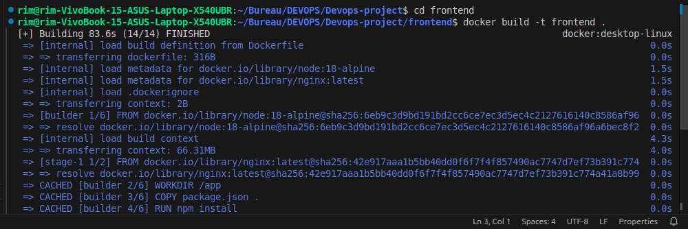
 
   - **Backend** :
     
     ```bash
     docker build -t backend-image ./backend
     
 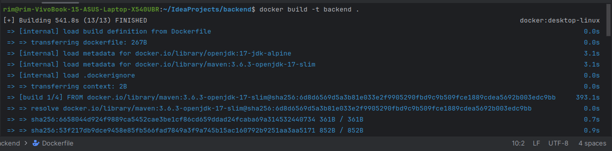 

 3. Configurez PostgreSQL dans Docker :
    
    - **PostgreSQL** est conteneurisé et intégré au backend via Docker Compose.

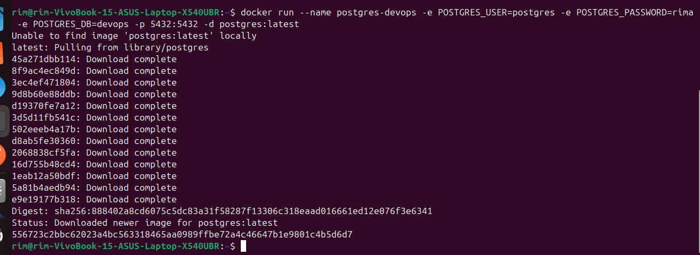

 4. Exécutez Docker Compose pour démarrer les services :
    
    ```bash
    docker-compose up --build

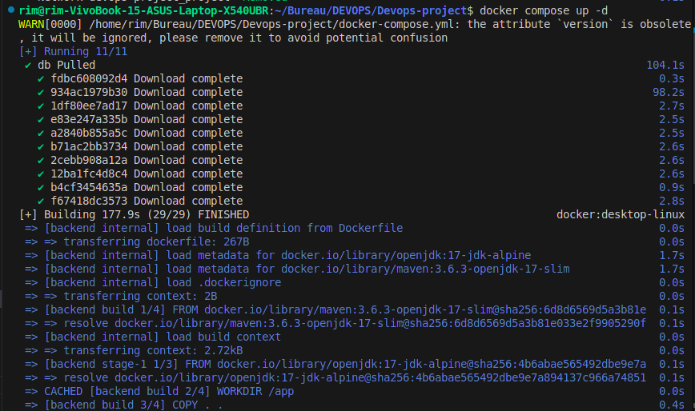  

5. Configurez Jenkins et exécutez le pipeline CI/CD :
   
   - Configurez **Jenkins** pour automatiser les étapes CI/CD :

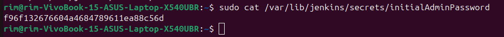 
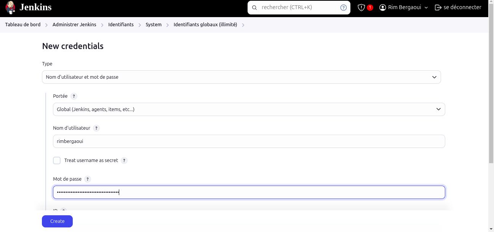  

- Poussez les images Docker sur Docker Hub :

  
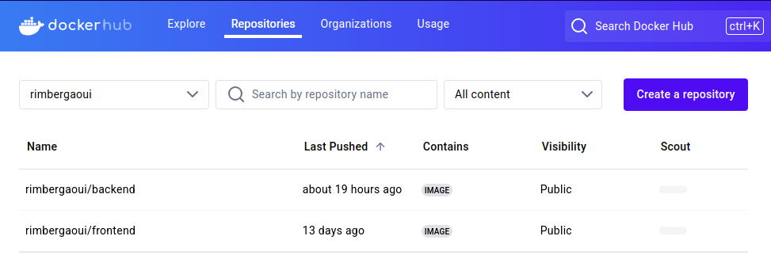 
     
   - Exécutez le pipeline complet :

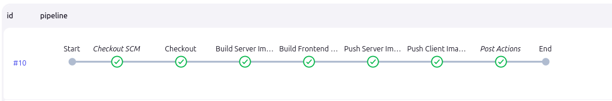 
   
6. Déployez les services sur Kubernetes :
   
    - Utilisez **Helm Charts** pour orchestrer le déploiement Kubernetes :


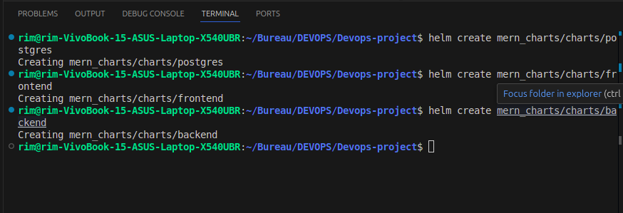 
    - Intégration de **ArgoCD** pour la mise en place d’une stratégie GitOps : 
      
     
    
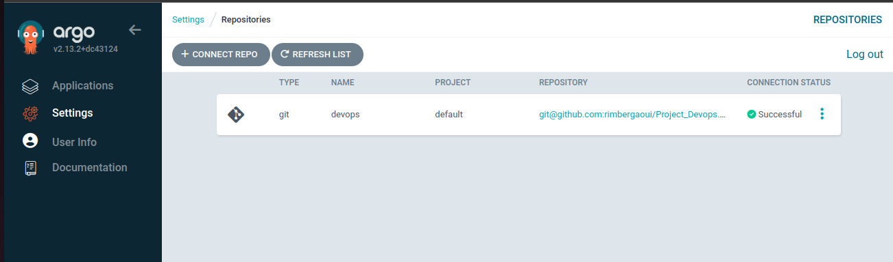 
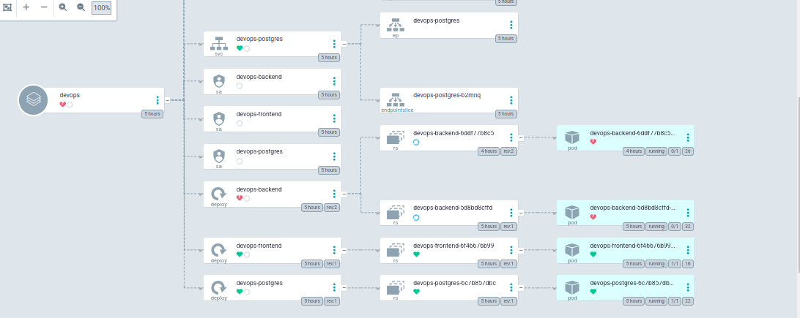 

7. Monitoring et Observabilité :

L'intégration d'un système de monitoring est essentielle pour la visibilité des performances des services. Voici les étapes suivies pour configurer le monitoring avec **Prometheus** et **Grafana** :

    - Déploiement de Prometheus pour collecter les métriques : 
    
    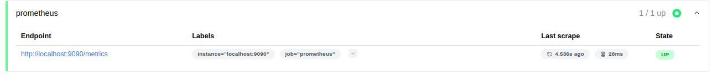 

    - Configuration de Prometheus et Grafana : 

    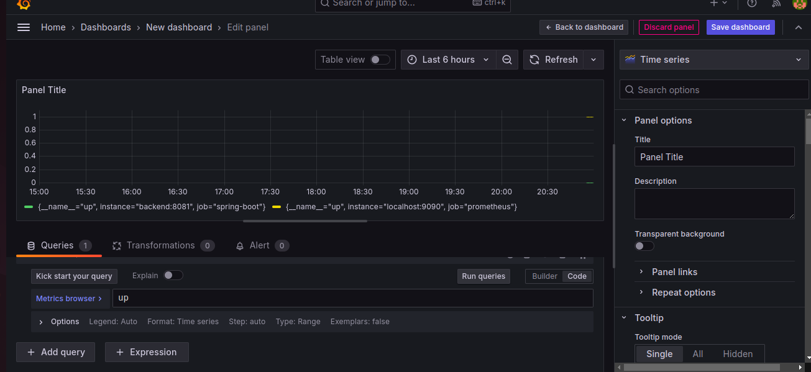 


    
